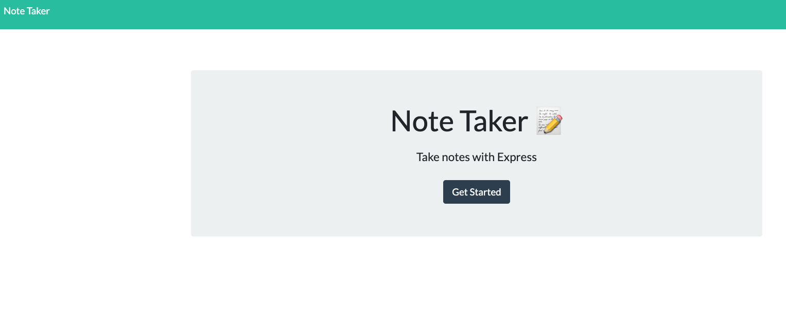
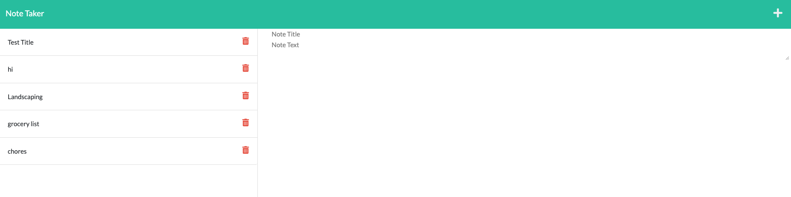

# Note Taker using Express.js
  ## Description
  This application allows you to enter and save notes. 

[This link](https://protected-sierra-72070.herokuapp.com/) will take you to the deployed site via Heroku.
 
  ## Table of Contents
  * [Installation](#installation)
  * [Usage](#usage)
  * [License](#license)
  * [Contributions](#contributions)
  * [Testing](#testing)
  * [Questions](#questions)
  
  ## Installation
  Installation instructions will be provided when this application has been updated.
  
  ## Usage
  Usage instructions will be provided soon!
 
  ## License
 Copyright © 2022 [Caren Merz](https://github.com/cammeer).  
This project is [MIT](https://github.com/cammeer/next-progress-bar/blob/main/LICENSE) licensed.
  
  ## Contributions
  I was the only contributor for this project so far. If you would like to contribute, see my email below.
 
  ## Tech
  * JavaScript
  * Node.js
  * Express.js
  * HTML
  * CSS

  
  ## Testing
  N/A
  
  ## Any Questions?
  This project was created by me: [cammeer](https://github.com/cammeer)
  
  Contact me with any questions at: [caren@merzhaus.org](caren@merzhaus.org)